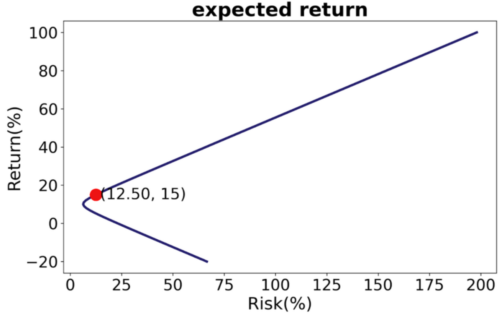

# Asset-Management-and-Efficient-Frontier

# Motivation and Purpose

1. Different asset allocation ratios based on varying risk tolerance levels.<br>
2. Users can select desired individual stocks to invest in and input expected returns.<br>
3. Python calculates the efficient frontier and exports expected risk and asset allocation.<br>
4. Excel is used for Monte Carlo analysis, exporting both the best and worst-case scenarios.<br>
5. Related research: There are many studies on the efficient frontier and Monte Carlo analysis available online, but none provide a complete, user-oriented design with an interactive window for analysis.<br>

# Method

1. Create a GUI using tkinter and its related packages.<br>
2. Obtain individual stock lists and interact with users through the ssl package.<br>
3. Scrape information of listed stocks from the stock exchange.<br>
4. Draw the efficient frontier after calculations using Python.<br>
5. Conduct Monte Carlo analysis using Excel.<br>

```python
import scipy.optimize as solver
import matplotlib.pyplot as plt
import tkinter.font as tkFont
import tkinter.messagebox
import tkinter as tk
import pandas as pd
import numpy as np
import requests
import random
import string
import time
import json
import ssl
from pathlib import Path
from functools import reduce
from PIL import Image, ImageTk
from bs4 import BeautifulSoup
from pandas.core.frame import Dataframe
from datetime import datetime
from dateutil.relativedelta import relativedelta
```


# Plotting the Efficient Frontier

1.  Using PIL and tkinter packages: Create a GUI window, background, and input-output list fields.<br>
2. Establish two functions:<br>
• One function to list the individual stocks selected by the user.<br>
• Another function to delete the individual stocks selected by the user.<br>

__After scraping the list of codes from the Taiwan Stock Exchange, display it in the left column of the window and create a drop-down menu for user selection.__

```python
import requests
from bs4 import BeautifulSoup
all_stock =[]

res = requests.get("https://www.twse.com.tw/zh/stockSearch/stockSearch")
html = BeautifulSoup(res.text, "html.parser")

st_list = html.findAll("td")

row = 2
for name in st_list:
  names = name.text
  row += 1
  all_stock.append(names)
print(all_stock)
```


__User Interface: Stock Picking__


__User Interface: Debug__


__Web Crawler__

```python
# waiting time (random)
waiting_time = [1, 2, 3, 4, 5]
for j in range(len(list_find)):
  print("爬取第" + str(j + 1) + "檔股票中")
  roi_list = []

  for k in range(12):
    month = datetime.now() + relativedelta(months = k - 11)
    month = month.strftime('%Y%m%d')

    uri = 'https://www.twse.com.tw/exchangeReport/STOCK_DAY?response=json&date=' # 台灣證券交易所
    uri_find = uri + month + '&stockNo=' + str(list_find[j])
    res = requests.get(uri_find)
    stock_json = res.json()


    # 1/17----------------------
    stockdf = pd.DataFrame.from_dict(stock_json['data'])
    # df = df.append(stockdf, ignore_index = True)


    daily_first = float(stock_json['data'][0][3].translate(str.maketrans('', '', string.punctuation))) # 月初開盤價
    daily_last = float(stock_json['data'][-1][-3].translate(str.maketrans('', '', string.punctuation))) # 最近或月底收盤價
    roi = (daily_last - daily_first) / daily_first # 月報酬率
    roi_list.append(roi)

    print("爬取第" + str(k - 11) + "個月中")
    print(uri_find)
    print(stockdf.head()) # 先看看資料集長怎樣----------------------
    # df.columns = ['日期', '成交股數', '成交金額', '開盤價', '最高價', '最低價', '收盤價', '漲跌價差', '成交筆數']
    # 寫入csv檔----------------------
    # stockdf.to_csv("stock_code" + str(j + 1) + str(k - 11) + ".csv")
    datadf.append(stockdf) # ----------------------

    actual_waiting_time = random.choice(waiting_time)
    time.sleep(actual_waiting_time)
    # 寫入csv檔----------------------
    stockdf.to_csv('stock_code' + str(list_find[j]) + '.csv', mode='a', header=False)
```

__Output CSV.__


# Plotting the Efficient Frontier

After obtaining the necessary data:<br>

1. Use a minimization method to find the minimum variance portfolio.<br>
2. Convert the previously scraped monthly returns of individual stocks into a DataFrame and calculate the covariance matrix and expected returns.<br>
3. Constraints are set to ensure that the sum of all weights equals 1 (short selling is not considered), and the weighted sum of expected returns meets the preset expected return.<br>
4. Use the solver's minimize method to find the minimum variance portfolio, which represents the investment weights for each stock.<br>



1101 台泥 78.82%
2330 台積電 40.17%
2515 中工 -18.98%

# Using Excel for Monte Carlo Analysis

To understand the possible profit and loss limits of such an investment, we use the following model to implement the Monte Carlo simulation.


